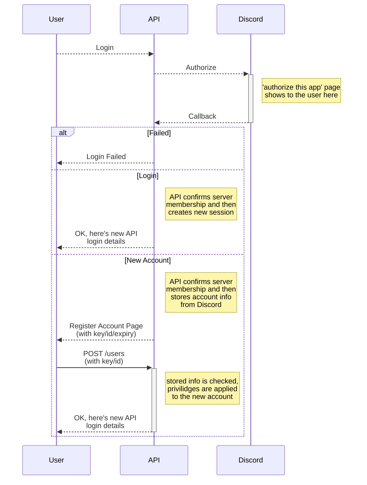
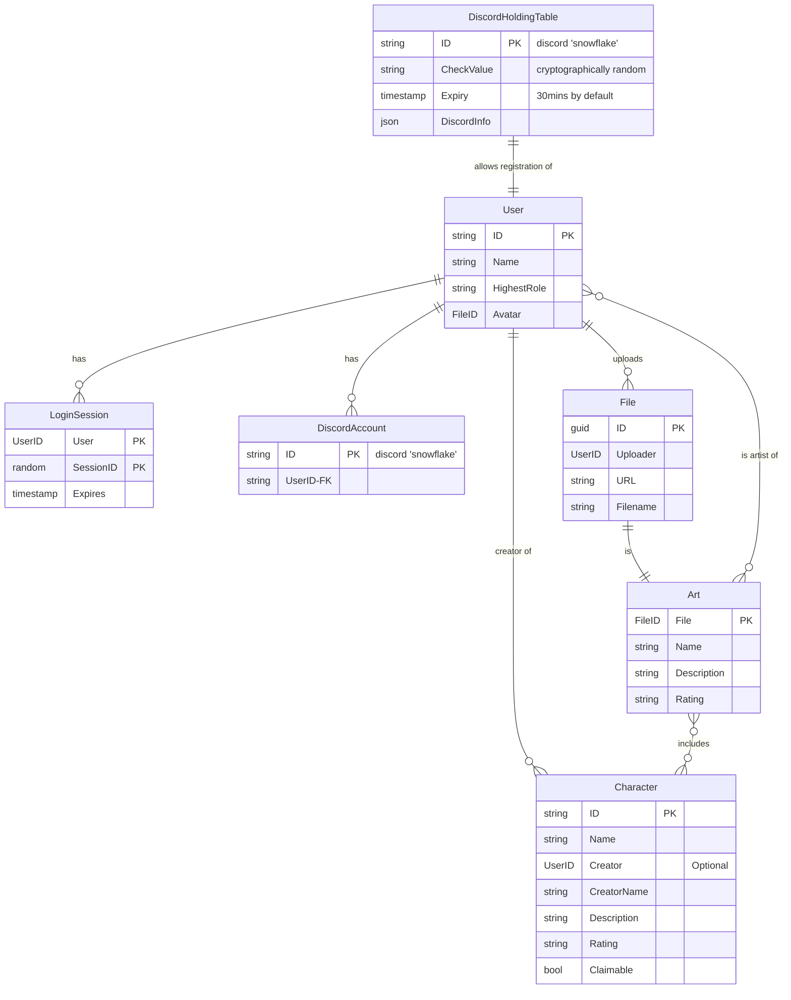

Here's the login flow:

```mermaid
sequenceDiagram
    participant User
    participant API
    participant Discord
    User-->>API: Login
    API-->>+Discord: Authorize
    Note right of Discord: 'authorize this app' page <br>shows to the user here
    Discord-->>-API: Callback
    alt Failed
    API-->>User: Login Failed
    else Login
    Note right of API: API confirms server<br>membership and then<br>creates new session
    API-->>User: OK, here's new API<br>login details
    else New Account
    Note right of API: API confirms server<br>membership and then<br>stores account info<br>from Discord
    API-->>User: Register Account Page<br>(with key/id/expiry)
    User->>+API: POST /users<br>(with key/id)
    Note right of API: stored info is checked,<br>privilidges are applied<br>to the new account
    API-->>-User: OK, here's new API<br>login details
    end

```

Here's the db layout:

```mermaid
erDiagram
    DiscordHoldingTable {
        string ID PK "discord 'snowflake'"
        string CheckValue "cryptographically random"
        timestamp Expiry "30mins by default"
        json DiscordInfo
    }
    DiscordHoldingTable ||--|| User : "allows registration of"
    User ||--o{ LoginSession : has
    User ||--o{ DiscordAccount : has
    User {
        string ID PK
        string Name
        string HighestRole
        FileID Avatar
    }
    LoginSession {
        UserID User PK
        random SessionID PK
        timestamp Expires
    }
    DiscordAccount {
        string ID PK "discord 'snowflake'"
        string UserID-FK
    }
    User ||--o{ Character : "creator of"
    Character {
        string ID PK
        string Name
        UserID Creator "Optional"
        string CreatorName
        string Description
        string Rating
        bool Claimable
    }
    User ||--o{ File : uploads
    File {
        guid ID PK
        UserID Uploader
        string URL
        string Filename
    }
    File ||--|| Art : is
    Art }o--o{ Character : "includes"
    User }o--o{ Art : "is artist of"
    Art {
        FileID File PK
        string Name
        string Description
        string Rating
    }

```