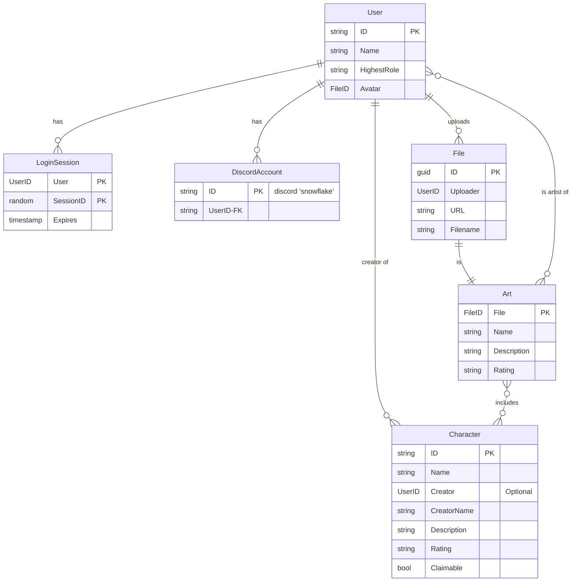

Here's the db layout:

```mermaid
erDiagram
    User ||--o{ LoginSession : has
    User ||--o{ DiscordAccount : has
    User {
        string ID PK
        string Name
        string HighestRole
        FileID Avatar
    }
    LoginSession {
        UserID User PK
        random SessionID PK
        timestamp Expires
    }
    DiscordAccount {
        string ID PK "discord 'snowflake'"
        string UserID-FK
    }
    User ||--o{ Character : "creator of"
    Character {
        string ID PK
        string Name
        UserID Creator "Optional"
        string CreatorName
        string Description
        string Rating
        bool Claimable
    }
    User ||--o{ File : uploads
    File {
        guid ID PK
        UserID Uploader
        string URL
        string Filename
    }
    File ||--|| Art : is
    Art }o--o{ Character : "includes"
    User }o--o{ Art : "is artist of"
    Art {
        FileID File PK
        string Name
        string Description
        string Rating
    }
```